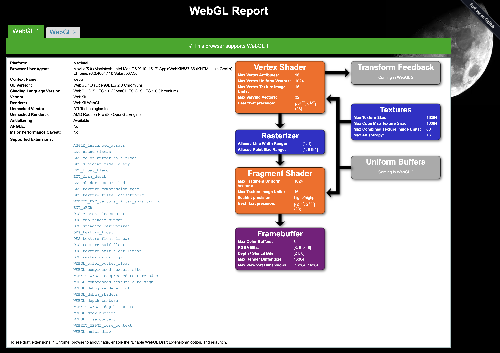

Project 0 Getting Started
====================

**University of Pennsylvania, CIS 565: GPU Programming and Architecture, Project 0**

* Jingtao Huang 
  * [LinkedIn](https://www.linkedin.com/in/jingtaoh/), [personal website](https://www.jingtaoh.com/).
* Tested on: MacOS Monterey, i7 @ 4.2GHz 40GB, Radeon Pro 580 8GB

### WebGL 

