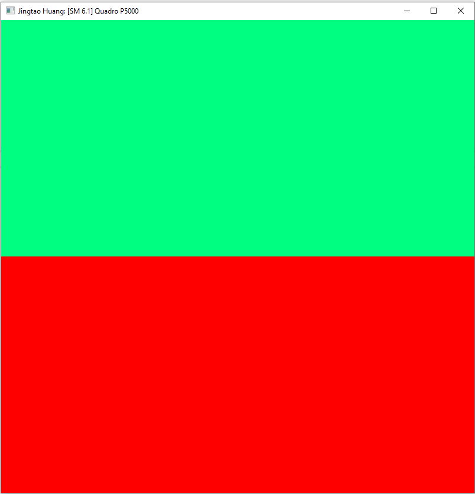

Project 0 Getting Started
====================

**University of Pennsylvania, CIS 565: GPU Programming and Architecture, Project 0**

- Jingtao Huang 
  - [LinkedIn](https://www.linkedin.com/in/jingtaoh/), [personal website](https://www.jingtaoh.com/).

## CUDA
- Tested on: Windows 10, Intel(R) Xeon(R) CPU E5-2667 v3 @ 3.20GHz, NVIDIA Quadro P5000

- CUDA Compute Capability: 6.1


### CUDA Project


### Nsight Profiling


### Nsight Debugging
```text
    index = 1024
    blockIdx = 14
    threaIdx = 0
```


## WebGL 
- Tested on: MacOS Monterey, i7 @ 4.2GHz 40GB, Radeon Pro 580 8GB


